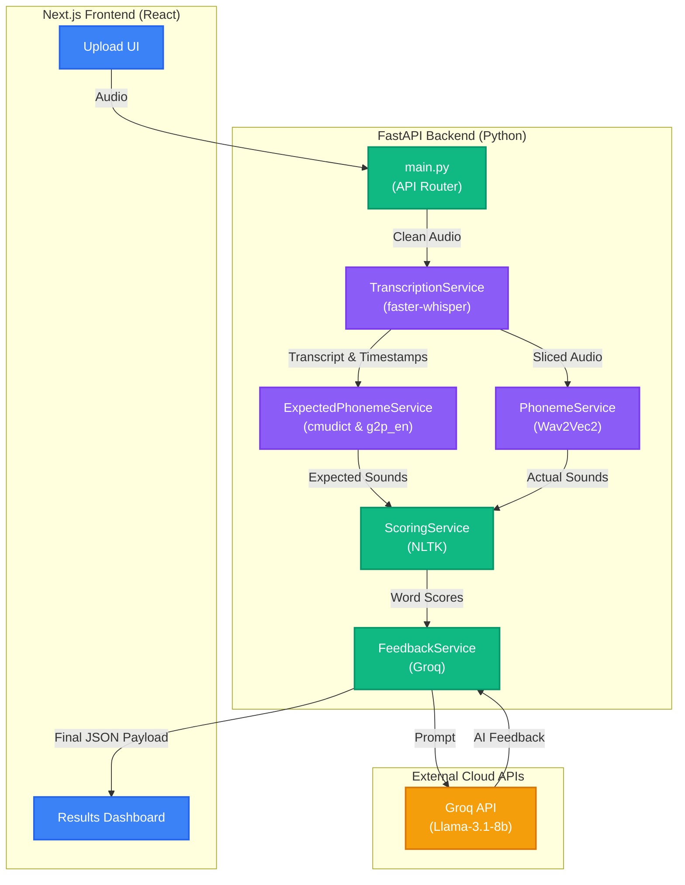

# VoiceAI - AI Pronunciation Assessment Tool

VoiceAI is a full-stack web application designed to help non-native English speakers improve their pronunciation. By leveraging local machine learning models and cloud-based LLMs, it provides a highly detailed, word-by-word breakdown of a user's spoken English compared to standard textbook pronunciation, complete with actionable coaching feedback.

## 🚀 Features

- **Language Validation**: Ensures the uploaded audio is actually English using Whisper before processing.
- **Word-Level Timestamps**: Uses `faster-whisper` to transcribe audio and locate the exact start and end timestamps of every spoken word.
- **Phoneme Alignment & Scoring**:
  - Compares the **Expected Pronunciation** (using `cmudict` or `g2p_en` neural fallback for proper nouns) against the **Actual Pronunciation** (extracted from the raw audio using a `Wav2Vec2` phoneme model).
  - Scores every individual word using Levenshtein distance matching on the phonemes.
- **AI Speech Coach**: Synthesizes the phonetic errors and overall score using the Groq API (Llama 3.1) to generate a customized, encouraging practice routine without hallucinating errors.
- **Beautiful UI**: Built with Next.js and Tailwind CSS, featuring smooth micro-interactions powered by Framer Motion.

---

## 🏗️ Architecture



---

## 💻 Tech Stack

**Frontend:**
- [Next.js](https://nextjs.org/) (App Router)
- React
- Tailwind CSS
- Framer Motion

**Backend:**
- [FastAPI](https://fastapi.tiangolo.com/) (Python)
- [FFmpeg](https://ffmpeg.org/) (Audio normalization)
- [faster-whisper](https://github.com/guillaumekln/faster-whisper) (Transcription & Timestamps)
- [Hugging Face Transformers](https://huggingface.co/) (`vitouphy/wav2vec2-xls-r-300m-phoneme`)
- `g2p_en` & `nltk` (Expected Phonemes)
- [Groq API](https://groq.com/) (Llama-3.1-8b for Speech Coach Feedback)

---

## 🛠️ Local Setup Instructions

### Prerequisites
- **Node.js** (v18+)
- **Python** (3.9+)
- **FFmpeg** installed on your system.

### 1. Backend Setup (FastAPI)

Navigate to the backend directory and set up a Python virtual environment:

```bash
cd backend
python -m venv venv
source venv/bin/activate  # On Windows use `venv\Scripts\activate`
```

Install the requirements:

```bash
pip install -r requirements.txt
```

Create a `.env` file in the `backend/` folder and add your Groq API key:

```env
GROQ_API_KEY=gsk_your_api_key_here
```

Start the FastAPI server:

```bash
uvicorn main:app --reload
```
*(The API will be available at `http://localhost:8000`)*

### 2. Frontend Setup (Next.js)

Open a new terminal, navigate to the client directory, and install the dependencies:

```bash
cd client
npm install
```

Start the Next.js development server:

```bash
npm run dev
```
*(The frontend will be available at `http://localhost:3000`)*

---

## 🧠 How the Phoneme Matching Works

1. The backend relies on **Whisper** to provide accurate, word-by-word timestamps. 
2. It slices the original audio file into tiny chunks—one chunk per word.
3. It passes the text of the word to an **Expected Phoneme** dictionary (`cmudict` with a `g2p_en` neural fallback for proper nouns).
4. It passes the audio chunk of the word to the **Actual Phoneme** Wav2Vec2 model to extract exactly how the user sounded.
5. It computes the **Levenshtein distance** between the two arrays of phonetic sounds to score the word.

---

*Built by Bodhi132*
