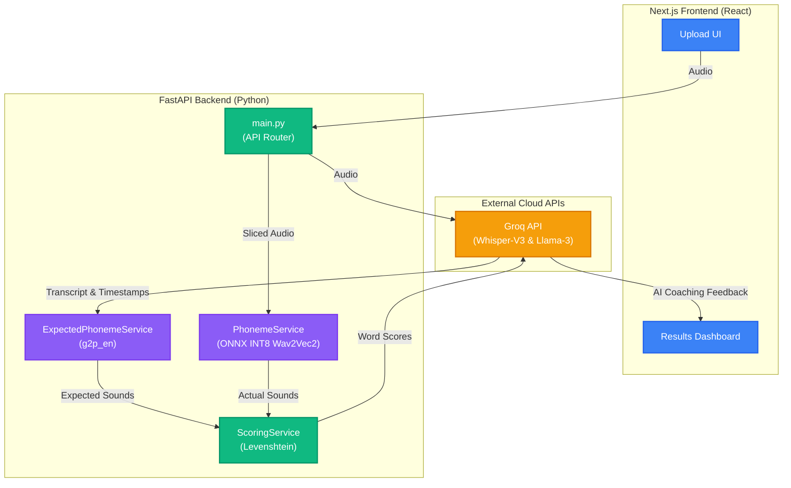

# VoiceAI - AI Pronunciation Assessment Tool

VoiceAI is a full-stack web application designed to help non-native English speakers improve their pronunciation. By leveraging highly optimized local ONNX models and cloud-based LLMs, it provides a highly detailed, word-by-word breakdown of a user's spoken English compared to standard textbook pronunciation, complete with actionable coaching feedback.

## 🚀 Features

- **Blazing Fast Transcription**: Uses the **Groq API** (`whisper-large-v3`) to instantly transcribe audio and locate the exact start and end timestamps of every spoken word, while verifying the language is English.
- **Phoneme Alignment & Scoring**:
  - Compares the **Expected Pronunciation** (using `cmudict` or a `g2p_en` neural fallback for proper nouns) against the **Actual Pronunciation**.
  - **Memory-Optimized Local Inference**: Extracts actual phonemes from raw audio using a `Wav2Vec2` model (`vitouphy/wav2vec2-xls-r-300m-phoneme`). To fit into strict free-tier cloud environments, the 1.2 GB PyTorch model is mathematically compressed into a highly optimized 400 MB **INT8 ONNX graph**, allowing it to run entirely on the CPU with minimal RAM.
  - Scores every individual word using Levenshtein distance matching on the phonetic sounds.
- **AI Speech Coach**: Analyzes phonetic errors and overall scores using the Groq API (Llama 3) to generate a customized, encouraging practice routine.
- **Beautiful UI**: Built with Next.js and Tailwind CSS, featuring smooth micro-interactions powered by Framer Motion and a detailed results dashboard.

---

## 🏗️ Architecture



---

## ☁️ Deployment & CI/CD Strategy

To successfully deploy this memory-heavy AI application for free, a highly customized Continuous Integration (CI/CD) pipeline was built:

- **Frontend**: Deployed seamlessly on **Render**.
- **Backend**: Hosted on **Azure App Service (Linux)**.
- **GitHub Actions (The Secret Sauce)**: Azure's B1 tier has a strict 1.75 GB RAM limit and a 230-second startup timeout. Trying to download and quantize a 1.2 GB PyTorch model on Azure caused immediate `Out of Memory` crashes. To bypass this, a custom **GitHub Actions workflow** intercepts code pushes. GitHub's powerful 7 GB RAM runner downloads the PyTorch model, executes the `export_onnx.py` script to mathematically compress it into INT8 ONNX files, and packages the lightweight result directly to Azure. Azure simply boots up `uvicorn` and serves the API effortlessly!

---

## 💻 Tech Stack

**Frontend:**
- [Next.js](https://nextjs.org/) (App Router)
- React
- Tailwind CSS
- Framer Motion

**Backend:**
- [FastAPI](https://fastapi.tiangolo.com/) (Python)
- ONNX Runtime (CPU Inference)
- Numpy
- `g2p_en` & `nltk` (Expected Phonemes)
- [Groq API](https://groq.com/) (Whisper for transcription, Llama 3 for Speech Coach Feedback)

---

## 🛠️ Local Setup Instructions

### Prerequisites
- **Node.js** (v18+)
- **Python** (3.9+)
- **FFmpeg** installed on your system.

### 1. Backend Setup (FastAPI)

Navigate to the backend directory and set up a Python virtual environment:

```bash
cd backend
python -m venv venv
source venv/bin/activate  # On Windows use `venv\Scripts\activate`
```

Install the requirements and generate the ONNX model:

```bash
pip install torch transformers onnx onnxruntime onnxscript -r requirements.txt
python export_onnx.py
pip uninstall -y torch transformers onnxscript
```

Create a `.env` file in the `backend/` folder and add your Groq API key:

```env
GROQ_API_KEY=gsk_your_api_key_here
```

Start the FastAPI server:

```bash
uvicorn main:app --reload
```
*(The API will be available at `http://localhost:8000`)*

### 2. Frontend Setup (Next.js)

Open a new terminal, navigate to the client directory, and install the dependencies:

```bash
cd client
npm install
```

Start the Next.js development server:

```bash
npm run dev
```
*(The frontend will be available at `http://localhost:3000`)*

---

*Built by Bodhi132*
